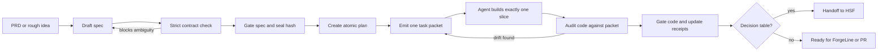

# SpecLine 🏭

**A spec-driven production line for AI coding agents.** PRD → spec → plan →
atomic task packets → gated code → production, with token-lean context
hygiene enforced by tooling instead of discipline, and a compiled-decision
handoff to [Harness Software Factory](../harness-factory) for the logic that
should never be improvised twice.

Works with **Claude Code, Codex, and any agent harness** — one command wires it in.

## Workflow at a glance



```
PRD ──> Spec (EARS+Gherkin) ──> Gate ──> Plan (atomic tasks) ──> Gate
                                                        │
              ┌─────────────────────────────────────────┘
              ▼
   ┌── Ralph Wiggum Loop ──┐        Decision tables in the spec
   │ specline loop next    │        ──> specline handoff
   │  → token-budgeted     │        ──> HSF compiles them ONCE into
   │    TASK PACKET        │            gated, deterministic code
   │ agent does ONE task   │            (zero tokens per decision, forever)
   │ specline loop done    │
   │  → verify + seal      │
   └──── context reset ────┘ ──> Gate ──> ship
```

## Why

Vibe coding hits the wall around four files: context pollution, intent
drift, API hallucinations. The fixes are known — specs as source of truth,
constitutions, vertical slices, context resets — but they live in blog
posts as *discipline*. SpecLine turns them into *tooling*: linted, gated,
hash-sealed, and receipt-audited, so the discipline holds at 2am too.

## Quickstart (5 minutes, no API keys)

```bash
pip install -e ".[dev]"
specline init                      # constitution + six-file context system
specline new refunds               # spec + plan skeletons
# ... you + your agent fill the spec ...
specline validate refunds          # EARS/Gherkin/leak lint — ambiguity dies here
specline gate spec refunds        # hash-sealed human signoff
specline tasks refunds             # atomicity lint: ≤4 files, one slice, verify cmd
specline gate plan refunds        # locks the spec hash (drift guard arms)
specline loop next refunds         # emits a token-budgeted TASK PACKET
# ... agent session does exactly one packet ...
specline loop done refunds T1      # runs verify command, seals receipt, advances
specline handoff refunds           # decision table -> HSF workflow spec
specline agent claude              # wires CLAUDE.md + /next-task command
specline status                    # token-savings receipt
pytest -q                          # 25 tests
```

## The mechanisms (what's actually enforced)

| Blog-post advice | SpecLine enforcement |
|---|---|
| "Write clear specs" | EARS keyword lint, Gherkin required, implementation-leak detection (`E_IMPL_LEAK`) |
| "Keep tasks small" | Atomicity linter: ≤4 files, one vertical slice, explicit verify command, no skeleton edits |
| "Reset agent context" | The loop emits self-contained **task packets** under a hard ~2.2k-token budget; one packet = one session |
| "Minimize context (C_t=γ·R_f·T_d)" | Packets list the exact R_f file set; excerpt only spec lines relevant to the task; deterministic prune over budget |
| "Prevent intent drift" | Plan gate seals the spec hash; if the spec changes, the loop **refuses** (`E_INTENT_DRIFT`) until re-gated |
| "Human review gates" | `specline gate spec|plan|code` writes hash-sealed signoff receipts to the progress tracker |
| "Don't let agents improvise business rules" | Decision tables compile through HSF: one-time generation, four gates, zero tokens per decision |
| "Measure the process" | SpecFactor gauge (Goldilocks 0.75–2.5) + a **context ledger**: packet tokens vs naive baseline, % saved |

## Agent integration

- **Claude Code:** `specline agent claude` → writes `CLAUDE.md` (constitution +
  protocol) and `.claude/commands/next-task.md`. The whole loop is one slash command.
- **Codex:** `specline agent codex` → appends the protocol to `AGENTS.md`
  (Codex reads it natively).
- **Anything else:** `specline agent <name>` → portable constitution file.
  The protocol is plain text; any harness that can read a file can follow it.

## The factory calibration (the part that saves real money)

Most business logic in AI-built apps is *decision-shaped*: ordered rules over
extracted facts. Letting agents re-implement those rules inline is how you get
inconsistent behavior and burned tokens. SpecLine specs carry a
`## Decision logic` table; `specline handoff` converts it to a Harness
Software Factory spec, and HSF compiles it once into deterministic, gated,
signed code — verified end-to-end in this repo's test suite against a real
HSF install. App code flows through the line; decisions flow through the
factory; nothing is improvised twice.

## Receipts culture

Every gate signoff, packet emission, and task completion writes a hash-sealed
line to `context/PROGRESS.md`, and the context ledger accumulates the token
economics (`specline status` — the walkthrough example shows ~75% saved vs
naive full-context sessions, and the gap widens as the repo grows). Claims
trace to receipts, never to vibes. That's the whole point.

MIT licensed.

---

## v0.2 — Strict Input Contract & Drift Audit

The base linter checks that a spec *looks* right (EARS keywords present, valid task
format). That's necessary but not sufficient: it lets **ambiguity** through, and the
AI coder then *invents* the missing parameters — which is drift. v0.2 closes that gap
with two new stages that bracket the coder.

### `specline strict <feature>` — reject ambiguity *before* the coder runs

Treats the spec as a **contract the coder must execute with zero invention**. Every
finding is a BLOCK with an exact line and fix. It catches the five drift sources:

1. **Incomplete requirements** — an EARS keyword isn't enough. Each requirement must
   have a concrete outcome verb (`return`/`reject`/`store`/…), not `handle`/`support`/
   `manage`. `The system shall handle it appropriately` is rejected.
2. **Surviving placeholders** — `<trigger>`, `<N>`, `TBD` can't reach an approved spec.
3. **Unquantified bounds** — a requirement that implies a timeout/limit/retry/size must
   state a number+unit.
4. **Untraceable acceptance** — every value in a Given/When/Then must be defined in a
   requirement or the data model. A Gherkin step can't introduce a fact the coder would
   have to invent.
5. **Non-deterministic decisions** — each rule's `if` references a declared fact and its
   `then` is exactly one outcome. No `maybe`/`or`/`etc`; no duplicate conditions.
   (`else`/`default` catch-all rows are allowed.)

An `approved` spec that still fails strict raises `S_APPROVED_BUT_AMBIGUOUS` — approval
is a lie until the blocks are resolved.

Strict is **on by default** in `specline gate spec|plan`. Pass `strict=False` to the
gate API only for legacy specs.

### `specline audit <feature> --files … --slice …` — catch drift *after* the coder runs

Compares what shipped against what the contract authorized:

- **`A_INVENTED_PARAM`** — a config value (`TIMEOUT = 45`) whose number the spec never
  authorized. The coder guessed; the audit fails the build.
- **`A_SCOPE_ESCAPE`** — a file outside the task's authorized slice.
- **`A_UNAUTHORIZED_FILE`** — a file not in the packet's list.
- **`A_STUB_LEFT`** — a `TODO`/`NotImplementedError` left behind.

### Requirement-scoped packets

The packet excerpt no longer bag-of-words-matches individual lines (which could hand the
agent half a requirement). It now ships **whole requirement blocks** and the **complete
acceptance scenario intact** — the agent never receives a partial rule to improvise around.

### Flow

```
new → write spec → validate → strict → gate spec → write plan → tasks → gate plan
    → loop (build) → audit → gate code → handoff
```

Deterministic by design: same spec text → same findings, every run. No LLM, no clock.
